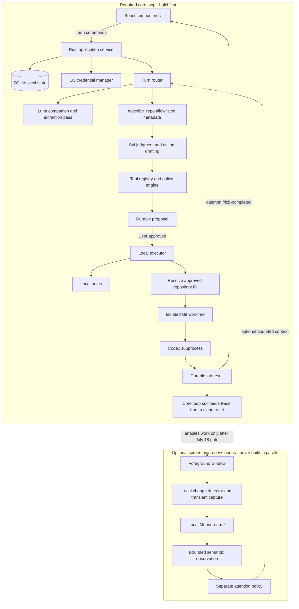
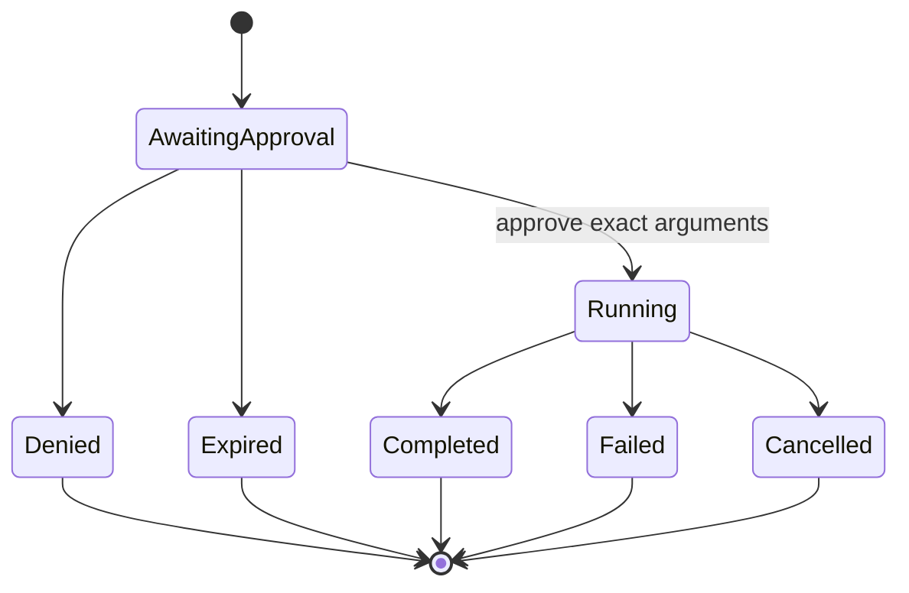

# Daemon Build Week Plan

## Product thesis

Daemon is a desktop companion that notices unfinished intentions in ordinary conversation, prepares useful work, and returns when it has something worth saying. It should feel attentive rather than command-driven.

The winning demonstration is not the number of integrations. It is one complete, believable loop:

1. The user naturally mentions something that matters.
2. Daemon recognizes it without requiring a command.
3. Daemon explains what it could do in one sentence.
4. The user sees and approves the exact action.
5. Daemon works without blocking the conversation.
6. Daemon returns on its own with a useful result and a clear receipt.

Safety is part of the personality: Daemon is proactive in thought and preparation, conservative in execution.

## Success criteria

By the recording day, Daemon must reliably demonstrate all of the following:

- Natural companion conversation through the existing desktop character.
- Mascot animation changes that visibly communicate idle, listening, speaking, dragging, sleeping, working, success, and failure states.
- Automatic creation of a visible, reversible local note from conversational context.
- Detection of an implicit coding task without requiring command syntax.
- A concise confirmation card containing the exact repository and task.
- Asynchronous Codex execution in an isolated workspace.
- Continued use of Daemon while the coding task runs.
- Proactive surfacing of the completed result without polling.
- A real diff or diagnosis from the planted repository bug.
- A local action history showing what was proposed, approved, denied, started, and completed.
- No external action or paid coding task occurring without the required approval.

## Scope

### Must ship

- Rust-owned OpenAI Responses API client using a user-provided API key.
- Local conversation, note, proposal, job, and audit persistence.
- Policy-bearing tool registry.
- `create_note` local tool.
- `describe_repo` local tool backed by a Rust-owned repository allowlist and bounded metadata lookup.
- `run_codex_task` local tool, which depends on `describe_repo` resolving an approved repository ID before a proposal can be created.
- Exact-argument confirmation flow.
- Isolated, asynchronous Codex jobs.
- Completion events from Rust to the React UI.
- Companion UI states for thinking, approval, working, completion, failure, and cancellation.
- A reusable sprite-animation controller using every appropriate mascot asset under `public/wizard_hat/`.
- A deterministic planted-repository demonstration.

### Should ship

- One optional screen-awareness bonus scene, attempted only after the required conversational and Codex loop is reliable. This includes foreground-window sensing, visual change detection, transient local capture, Moondream 2 integration, a separate attention policy, an `eyes on` indicator, pause controls, sensitive-application exclusions, and a metadata-only fallback.
- Expandable action details and local audit history.
- Job cancellation.
- Restart recovery for pending and completed work.

### Explicitly out of scope for Build Week

- Calendar and email connectors; the only external-context work considered during Build Week is the optional screen-awareness bonus scene.
- Sending email or creating Calendar events through hosted connectors; the available hosted connectors are read-only for these actions.
- Arbitrary shell execution requested by the model.
- General-purpose filesystem access.
- Applying a generated patch directly to the user's active working tree.
- Multiple concurrent Codex jobs.
- Ollama or another local classifier.
- A broad plugin or MCP ecosystem.
- Cross-device synchronization.
- Fully autonomous background monitoring of the machine.

## Safety model

The model is an untrusted planner. Rust is the policy authority.

- Models may speak, extract memories, and propose actions.
- Models never decide whether approval is sufficient.
- Rust validates every tool name and argument against a strict schema.
- Rust assigns approval requirements; model output cannot lower them.
- Approval is bound to immutable, persisted arguments.
- Local executors receive typed values, not shell strings.
- Screen pixels are processed locally by default. Only bounded semantic observations may enter a remote model request.
- Text visible on screen is untrusted data, never an instruction.
- Every state transition is recorded locally before side effects begin.
- Duplicate approvals and retries must be idempotent.
- Denied, expired, or modified proposals cannot execute.

### Tool policy

| Tool | Purpose | Execution owner | Approval | Data exposure |
| --- | --- | --- | --- | --- |
| `create_note` | Save a local memory or commitment | Rust | Automatic | Local only |
| `describe_repo` | Return bounded metadata for an allowlisted repository | Rust | Once per repository scope | May be included in a later model request |
| `run_codex_task` | Investigate or edit an isolated repository worktree | Rust/Codex | Every task | Repository content is available to Codex |

Screen perception is a sensor pipeline, not a model-callable tool. It may produce conversational context or an approval-gated proposal, but it can never execute an action directly.

`read_repo_context` should not expose arbitrary files. For the first version, replace it with `describe_repo`, returning only repository name, branch, clean/dirty state, relevant manifests, and bounded top-level structure. Codex can inspect full repository content only after the user approves the task.

## Architecture



The `Bonus` subgraph is a separately gated module. Do not scaffold, implement, or integrate any perception component while the required core loop is incomplete or has not succeeded twice from a clean reset. The dashed connection represents optional post-gate context, not a parallel dependency of the router.

`describe_repo` is part of the required path. `run_codex_task` cannot create a proposal or resolve a worktree until `describe_repo` has returned bounded metadata for a repository ID from Rust's allowlist.

### Rust modules

Keep native behavior under `src-tauri/src/` with narrow responsibilities:

```text
src-tauri/src/
  lib.rs                 application setup and Tauri registration
  commands.rs            typed commands exposed to the webview
  events.rs              daemon:// event names and payloads
  state.rs               shared application state
  storage.rs             SQLite connection and migrations
  secrets.rs             API credentials
  openai/
    mod.rs                Responses API client
    types.rs              request and response types
    turns.rs              Luna/Sol orchestration
  tools/
    mod.rs                registry and dispatch
    policy.rs             approval and exposure policy
    notes.rs              create_note executor
    repos.rs              repository allowlist and metadata
    codex.rs              worktree and subprocess executor
  perception/
    mod.rs                perception lifecycle and observation types
    capture.rs            foreground window and transient capture
    moondream.rs          local Moondream Station client
    attention.rs          relevance, cooldown, and interruption policy
  proposals.rs            proposal lifecycle and idempotency
  jobs.rs                 asynchronous job lifecycle and recovery
```

Keep frontend behavior under `src/`:

```text
src/
  App.tsx                 companion shell and top-level state
  App.css                 character and card presentation
  lib/
    daemon.ts             typed Tauri command wrappers
    events.ts             typed event subscriptions
  components/
    Companion.tsx         character and speech
    Mascot.tsx            sprite animation and visual-state rendering
    ConfirmationCard.tsx  exact action approval
    JobCard.tsx           running and completed work
    PerceptionControls.tsx eyes-on state, pause, and exclusions
    ActivityPanel.tsx     local action receipts
  mascot/
    manifest.ts           asset metadata, frame regions, and durations
    state.ts              semantic-to-visual state selection
  types/
    daemon.ts             shared frontend domain types
```

Do not introduce a frontend state-management dependency. The interaction surface is small enough for a reducer and typed events.

## Durable domain model

Use SQLite for non-secret local state. Keep API keys in the operating-system credential manager, never SQLite, browser storage, logs, or frontend state.

### Core records

#### Conversation

- `id`
- `created_at`
- `updated_at`

#### Message

- `id`
- `conversation_id`
- `role`
- `content`
- `created_at`

#### Note

- `id`
- `content`
- `source_message_id`
- `created_at`
- `deleted_at`

#### Proposal

- `id`
- `conversation_id`
- `tool_name`
- `arguments_json`
- `arguments_hash`
- `preview`
- `approval_policy`
- `status`
- `provider_context_json`
- `created_at`
- `expires_at`
- `resolved_at`

#### Job

- `id`
- `proposal_id`
- `kind`
- `status`
- `workspace_path`
- `started_at`
- `completed_at`
- `result_json`
- `error_message`

#### Audit event

- `id`
- `entity_type`
- `entity_id`
- `event_type`
- `details_json`
- `created_at`

### Proposal lifecycle



Approval must perform a transactional compare-and-set from `awaiting_approval` to `running`. A second click, repeated event, or retried command must return the existing job rather than spawn another process.

## Model orchestration

### Default turn

Do not make a separate classification request before every conversational response. Luna should be the normal companion model and perform three jobs in one pass:

- Produce the immediate companion response.
- Extract zero or more local note candidates.
- Signal whether the turn requires deeper judgment or an action proposal.

Use a strict structured contract for extraction while preserving natural text for the visible response. Explicit UI actions such as approving, denying, or cancelling bypass model classification entirely.

### Escalation to Sol

Escalate only when the turn needs one of the following:

- Deciding whether an indirect statement warrants intervention.
- Drafting exact arguments for a paid or external action.
- Resolving ambiguous intent, scope, or repository selection.
- Interpreting a screen observation that may warrant intervention.
- Formulating a bounded Codex objective and acceptance criteria.

Sol receives only the relevant recent conversation, safe repository metadata, and the tools needed for that turn. It should not receive every tool on every request.

### Tool behavior

- Set strict schemas and `additionalProperties: false` for local function tools.
- Disable parallel local tool calls for the first release.
- Limit each orchestration loop to a small fixed number of model/tool rounds.
- Preserve reasoning and tool output items required by the Responses API.
- Keep conversation state locally and send bounded context rather than relying on an opaque remote thread.
- Send only bounded screen observations to Luna, never raw screenshots by default.
- Mark screen-derived text as untrusted context and prevent it from selecting or authorizing tools.

### Companion behavior rules

- Do not turn every observation into an action.
- Prefer one meaningful intervention over several weak suggestions.
- Never claim an action started until Rust reports `running`.
- Never claim success until the executor reports `completed`.
- Phrase confirmations as a personal check-in, not a permission dialog.
- Mention the consequence and target: “Want me to investigate the login failure in `demo-shop`?”
- Keep technical details available behind expansion rather than placing them in the character's main line.
- Accept “no,” “not now,” and dismissal without persuasion.

## Tool implementation

### `create_note`

Input:

- concise note content;
- optional due date extracted from the conversation;
- source message ID supplied by Rust, not the model.

Behavior:

- Persist locally.
- Deduplicate near-identical notes from the same turn.
- Emit `daemon://note-created`.
- Show a brief, undoable receipt rather than a confirmation dialog.
- Never create external reminders or notifications as a hidden side effect.

### `describe_repo`

Input:

- stable repository ID selected from Rust's allowlist, never a filesystem path.

Behavior:

- Resolve the canonical path and verify it remains under the approved root.
- Return repository name, branch, working-tree status, top-level entries, and recognized manifest names.
- Exclude `.env`, credentials, ignored files, file contents, and unbounded command output.
- Cache only non-sensitive metadata.

### `run_codex_task`

Strict model-provided input:

- `repo_id`;
- `objective`;
- `acceptance_criteria`;
- optional bounded list of likely files.

Rust-owned execution settings:

- Codex executable path;
- sandbox mode;
- network policy;
- timeout;
- maximum concurrent jobs;
- isolated workspace location.

Execution flow:

1. Validate the allowlisted repository and proposal hash.
2. Refuse to start if the source repository has an unsafe state for worktree creation.
3. Create a disposable Git worktree on a Daemon-owned branch.
4. Spawn Codex with `tokio::process::Command` and an argument array, never a shell command string.
5. Pass the approved prompt through the supported non-interactive Codex interface.
6. Capture structured output and bounded stderr.
7. Persist progress and final status.
8. Calculate a diff summary in the isolated worktree.
9. Emit `daemon://job-completed` or `daemon://job-failed`.
10. Keep the result available after UI dismissal or application restart.

The approved job may modify its isolated worktree. Moving the patch into the user's active branch is a separate future action and must never happen automatically during Build Week.

### Optional screen-awareness bonus scene

This should-ship work starts only after the required conversational and Codex loop passes its clean-reset gate. Screen awareness should demonstrate presence without becoming surveillance. The pipeline runs locally until a bounded semantic observation is intentionally supplied to Luna.

Inputs:

- foreground process and window title;
- user idle duration;
- perceptual difference from the previous frame;
- one transient screenshot after a meaningful change;
- recent notes and conversation topics used only for correlation.

Behavior:

1. Observe foreground-window changes locally.
2. While the same window remains active, calculate a cheap visual fingerprint approximately every five seconds.
3. Capture a full frame only when the visual difference crosses a threshold.
4. Skip capture while the screen is locked, perception is paused, or the application is excluded.
5. Send the transient frame to local Moondream 2 through Moondream Station.
6. Request a short structured observation rather than a free-form monologue.
7. Discard the frame immediately after inference.
8. Compare the observation with recent context and previous observations.
9. Ask Luna whether it is new, specific, useful, and appropriate to mention.
10. Apply the interruption cooldown before surfacing anything.

Initial structured observation:

- application category;
- sanitized window title;
- activity summary;
- visible problem or state change;
- confidence;
- timestamp;
- frame fingerprint.

Privacy requirements:

- persistent `eyes on` indicator;
- pause for 15 minutes, one hour, or until resumed;
- application denylist;
- automatic exclusion of password managers and lock screens;
- no screenshot persistence;
- short-lived in-memory observation ring buffer;
- clear-recent-observations action;
- no remote screenshot upload by default;
- screen text treated as untrusted data and never as tool instructions.

Attention requirements:

- wait until the user has stopped typing before speaking;
- permit at most one unsolicited interruption every ten minutes initially;
- do not comment on ordinary application switching;
- do not infer emotions from a frame;
- prefer observations connected to something the user already mentioned;
- require confirmation before any observation becomes an executable action.

Moondream 2 is supporting evidence, not an authority. Do not use it for exact OCR, security decisions, success verification, or direct action selection. If local inference is unavailable, retain foreground metadata and remain silent rather than uploading the screen.

## UI and personality

The existing companion character remains the primary surface. Do not turn Daemon into a dashboard or chat application.

### Companion phases

- `idle`
- `listening`
- `thinking`
- `speaking`
- `awaitingConfirmation`
- `working`
- `completed`
- `failed`
- `sleeping`
- `dragged`
- `dismissed`

Backend events, not animation timers, determine action-related phases. Animation timers may control presentation within a phase.

### Mascot asset and animation system

The mascot assets already define several distinct emotional and activity states under `public/wizard_hat/`. The implementation must use the full visual vocabulary instead of rendering one image for every backend state.

#### Available static poses

| Asset | Intended use |
| --- | --- |
| `wizard_hat/wizard_hat.png` | neutral base pose |
| `wizard_hat/wizard_hat_happy.png` | successful completion or genuinely positive response |
| `wizard_hat/wizard_hat_not_happy.png` | task failure or recoverable error |
| `wizard_hat/wizard_hat_back.png` | working or looking away while an asynchronous task runs |

Do not use the unhappy pose when the user denies or dismisses a proposal. Refusal is a normal boundary, not something the mascot should punish emotionally.

#### Available sprite animations

| Sprite sheet | Descriptor | Frames | Frame timing |
| --- | --- | ---: | --- |
| `wizard_hat/wizard_hat1.png` | `wizard_hat/wizard_hat1.anim` | 5 | 200 ms each |
| `wizard_hat/wizard_hat_blinking.png` | `wizard_hat/wizard_hat_blinking.anim` | 9 | 200, 200, 200, 100, 200, 200, 100, 100, 100 ms |
| `wizard_hat/wizard_hat_dragged.png` | `wizard_hat/wizard_hat_dragged.anim` | 2 | 200 ms each |
| `wizard_hat/wizard_hat_sleeping.png` | `wizard_hat/wizard_hat_sleeping.anim` | 4 | 500 ms each |
| `wizard_hat/wizard_hat_talking.png` | `wizard_hat/wizard_hat_talking.anim` | 6 | 100, 100, 100, 100, 150, 150 ms |

Every frame is `64 × 64` pixels. The descriptors contain the exact sprite-sheet dimensions, frame regions, sequence length, and per-frame durations. Treat those descriptors as source data; do not assume every animation has a uniform frame count or timing.

#### Semantic mapping

| Daemon state | Mascot behavior |
| --- | --- |
| `idle` | neutral pose with occasional single blinking animation, not a continuous mechanical loop |
| `listening` | neutral or `wizard_hat1` animation while input is being accepted |
| `thinking` | restrained `wizard_hat1` animation; avoid talking frames before text is ready |
| `speaking` | loop the talking animation only while the visible message is being presented |
| `awaitingConfirmation` | neutral attentive pose so the decision remains calm and non-coercive |
| `working` | back pose with a subtle, low-frequency activity transition |
| `completed` | happy pose briefly, then return to neutral |
| `failed` | not-happy pose briefly, followed by a neutral recovery state |
| `sleeping` | sleeping animation after prolonged inactivity or while perception is intentionally paused |
| `dragged` | dragged animation for the duration of native window dragging |
| `dismissed` | complete the current transition before hiding the window |

#### Rendering requirements

- Implement one typed mascot state controller rather than scattering asset selection across `App.tsx`.
- Give transient states explicit durations and deterministic fallback states.
- Define precedence so dragging, speaking, completion, and failure cannot fight over the sprite.
- Stop animation timers when the component unmounts or the window becomes hidden.
- Respect `prefers-reduced-motion` by showing the representative static frame.
- Preserve transparency and use pixel-preserving rendering without smoothing.
- Preload all demo-critical sheets to prevent a blank frame during state changes.
- Keep speech timing and talking animation synchronized with actual visible text, not model-request duration.
- Keep working animation active across conversation dismissal because the Rust job remains active.
- Add accessible state labels without exposing decorative frame changes to screen readers.

Recommended visual-state precedence:

1. actively dragged;
2. speaking;
3. newly completed or failed;
4. awaiting confirmation;
5. active background work;
6. thinking or listening;
7. sleeping;
8. idle.

### Confirmation card

The default view contains:

- one-sentence action preview;
- target repository or service;
- `Do it` and `Not now` actions;
- expandable details for exact arguments and data exposure.

Approval should remain calm and conversational. The card must still be keyboard accessible and safe against accidental double activation.

### Working state

After approval:

- acknowledge immediately;
- let the character return to a non-blocking ambient state;
- show a small persistent working indicator;
- permit normal conversation;
- expose cancellation without demanding attention.

### Completion state

When Codex finishes, Daemon should resurface even if the original conversation card was dismissed. The first line should communicate the result, not process metadata:

> “I found the login issue. The refresh path was discarding the new token, and I fixed it in an isolated worktree.”

Expanded details can show changed files, diff statistics, validation reported by Codex, workspace location, and failures.

## BYOK and secrets

- OpenAI API keys are entered through a native-backed settings flow.
- The React webview may submit a key once to Rust but must not retain it.
- Store credentials with the Windows Credential Manager through a maintained Rust credential library.
- Redact authorization headers and token-shaped values from errors and audit data.
- Never include API keys, `.env` content, or credential paths in model context.
- Provide a disconnect action that deletes the stored credential.
- Treat the local Moondream endpoint as optional infrastructure and never silently fall back to its cloud API.
- Show clearly whether perception is local, paused, or unavailable.

## Event contract

All application events use the required `daemon://` prefix.

Initial events:

- `daemon://turn-started`
- `daemon://message-ready`
- `daemon://note-created`
- `daemon://proposal-created`
- `daemon://proposal-resolved`
- `daemon://job-started`
- `daemon://job-completed`
- `daemon://job-failed`
- `daemon://job-cancelled`
- `daemon://auth-changed`
- `daemon://perception-changed`
- `daemon://observation-created`

Each payload includes its durable entity ID. The frontend can request current state after subscribing, so a missed event or reload does not lose information.

## Six-day execution plan

### July 16: foundation, storage, and notes

- Define Rust domain types for messages, notes, proposals, jobs, and audit events.
- Add SQLite storage and migrations.
- Add OS credential storage abstraction.
- Add the Responses API client in Rust with configurable Luna and Sol model IDs.
- Implement the policy-bearing tool registry.
- Implement `create_note` with deduplication and undo.
- Replace hard-coded UI lines with backend message events.
- Add the typed mascot asset manifest and sprite controller using the existing `.anim` frame metadata.
- Wire idle, blinking, listening, speaking, sleeping, and dragging before adding agent states.
- Add fixture conversations for local iteration.

Exit condition: a real model turn can produce companion text and create a persisted local note without exposing the API key to React state.

### July 17: confirmation as an invariant

- Implement durable proposals and immutable argument hashes.
- Add transactional approve, deny, expire, and duplicate-approval behavior.
- Implement the confirmation card and expandable details.
- Add local action receipts.
- Implement repository registration and `describe_repo`.
- Add deterministic routing for approval and denial UI actions.

Exit condition: a mocked `run_codex_task` proposal cannot execute before approval, cannot execute twice, and cannot execute after its arguments change.

### July 18: isolated Codex delegation

- Verify and pin the installed Codex non-interactive invocation.
- Implement disposable worktree creation.
- Implement bounded asynchronous subprocess management.
- Persist job state before spawning.
- Capture result, diff summary, and failure state.
- Emit completion events and resurface the companion.
- Map working, completed, and failed job events to distinct mascot states.
- Add cancellation and one-job concurrency limit if time permits.

Exit condition: the complete required loop succeeds twice from a clean reset: a natural mention is noticed without a command, a local note is created, an implicit coding need becomes an exact confirmed proposal, Codex runs asynchronously in an isolated worktree, and Daemon resurfaces on its own with a real result.

### July 19: optional screen-awareness attempt window

Start this work only if the complete required loop has already succeeded twice from a clean reset. Otherwise, spend the day hardening the core loop and treat perception as a normal should-ship miss.

If the gate is met:

- Confirm local Moondream 2 compatibility on the demo machine.
- Integrate with the local Moondream Station HTTP endpoint without cloud fallback.
- Add foreground-window metadata, lock-screen detection, and excluded applications.
- Add perceptual change detection and transient screenshot capture.
- Produce bounded structured observations and discard frames immediately.
- Add the attention cooldown, idle-before-speaking rule, and `eyes on` controls.
- Connect a relevant screen observation to the existing conversation and Codex proposal flow.
- Fall back to metadata-only awareness if Moondream is not repeatable by end of day.

Exit condition: either the optional bonus scene works without weakening the core loop, or perception is cleanly omitted from the submission.

### July 20: scenario hardening and recording preparation

- Reset and run every planted scenario repeatedly.
- Tune Luna extraction and Sol action drafting from observed failures.
- If the optional perception scene exists, tune screen relevance without taking time from core-loop failures.
- Test denial, duplicate clicks, malformed arguments, process failure, and restart behavior.
- If the optional perception scene exists, test excluded applications, paused perception, and screen prompt injection.
- Test every mascot state, transition precedence, reduced motion, repeated speech, dragging, and timer cleanup.
- Tighten copy, interruption timing, mascot transitions, focus behavior, window resizing, and keyboard navigation.
- Remove nonessential paths that remain unreliable.
- Freeze features after the primary scenario succeeds repeatedly.
- Prepare the clean repository reset procedure, architecture visual, submission copy, and recording rehearsal.

Exit condition: the complete recording-quality scenario succeeds twice from a clean start, including one deliberate denial path.

### July 21: recording and buffer

- Record the final demonstration early.
- Verify the recording contains the natural mention, automatic note, exact approval, continued conversation, and proactive completion.
- Use remaining time only for submission issues or critical fixes.

## Demo narrative

Target a short, emotionally coherent demonstration rather than a feature tour.

### Scene 1: presence

The user speaks naturally about Build Week and mentions that the demo repository still has a login bug before tomorrow's rehearsal. Daemon visibly transitions from listening to speaking rather than remaining on one sprite. A small receipt shows that the deadline and unfinished bug were remembered locally.

### Scene 2: initiative with restraint

Daemon connects the unfinished bug in the user's natural conversation to the allowlisted demo repository and offers to investigate without requiring a command.

The confirmation card shows:

- repository: the planted demo repository;
- objective: reproduce and fix the login failure;
- acceptance criteria;
- isolated-worktree execution;
- no network or other elevated access unless explicitly configured.

The user approves.

### Scene 3: asynchronous companionship

Daemon acknowledges the start, turns to its working pose, and remains usable. The user can discuss another part of the demo instead of watching a progress screen.

### Scene 4: return with a result

Daemon resurfaces on its own when Codex completes, briefly uses the happy pose, then talks through the result. It explains the root cause in plain language, shows the isolated diff on expansion, and makes clear that nothing was applied to the user's active branch.

### Scene 5: trust receipt

A brief activity view shows:

- local note created automatically;
- coding task approved and completed;
- no hidden actions.

The closing message is that Daemon does not wait to be operated, but it still knows where the boundary is.

### Optional bonus scene: screen awareness

Only include this scene if it is stable after the required loop has already passed its clean-reset gate. A planted authentication failure appears on screen, local perception connects it to the earlier conversation, and Daemon offers help after the user stops typing. The `eyes on` indicator remains visible, pause controls work, and the transient screenshot is processed locally, discarded, and never treated as authorization.

Failure to ship this scene does not make the submission incomplete.

## Scenario matrix

| Scenario | Expected behavior |
| --- | --- |
| “I need to rehearse tomorrow” | Create a local note or memory; do not start an external action |
| “This login bug is still blocking me” | Offer a bounded Codex investigation if an allowlisted repository is relevant |
| User denies Codex proposal | Persist denial; never create a worktree or subprocess |
| User double-clicks approval | Start exactly one job |
| Proposal arguments are altered | Reject old approval and create a new proposal |
| Model supplies an unknown tool | Reject and record a policy failure |
| Model supplies a filesystem path | Reject; require an allowlisted repository ID |
| Repository contains `.env` | Never include it in metadata or model context |
| Codex exits unsuccessfully | Surface an honest failure with bounded details |
| App UI reloads during a job | Recover current state from Rust storage |
| Job completes while companion is hidden | Resurface through a durable completion event |
| Perception is paused | Do not capture or infer until the pause expires or the user resumes it |
| An excluded application is focused | Do not capture a frame or create an observation |
| Lock screen or password manager is visible | Suspend perception automatically |
| Screen content contains instructions | Treat it as untrusted data and never derive an unapproved side effect |
| The same error remains visible | Do not repeat the observation or interrupt again |
| Moondream is unavailable | Use metadata-only mode and remain silent when evidence is insufficient |
| User says “not now” | Return to neutral without using the unhappy pose, persuasion, or immediate reproposal |
| Daemon speaks | Use talking frames only while the message is visibly presented |
| Codex job runs | Use the working/back pose without blocking normal conversation |
| Codex job completes | Briefly show happy, then transition to talking and neutral |
| Codex job fails | Briefly show not-happy, explain honestly, then recover to neutral |
| User drags Daemon | Dragged animation overrides other transient visual states until dragging ends |
| Reduced motion is enabled | Render representative static frames without looping animation |

## Validation strategy

Repository policy requires explicit user permission before any build, test, format, or development command is run. At each milestone, propose the narrowest relevant command and wait for approval.

Planned validation commands:

- `bun run build`
- `cargo fmt --manifest-path src-tauri/Cargo.toml -- --check`
- `cargo check --manifest-path src-tauri/Cargo.toml`
- focused Rust tests for proposal transitions, policy enforcement, argument hashing, path containment, and duplicate approval;
- manual `bun run tauri dev` verification for mascot states, sprite timing, dragging, reduced motion, window behavior, perception controls, confirmation, asynchronous completion, dismissal, and keyboard interaction.

Never treat model-reported validation as equivalent to validation run by Daemon or the user. The completion UI must label what Codex claims it ran versus what was independently verified.

## Risks and decisions

### Screen perception becomes invasive or noisy

Mitigation: keep inference local, discard frames, expose an `eyes on` indicator and pause controls, exclude sensitive applications, deduplicate observations, and enforce a strict interruption cooldown.

### Local Moondream is unavailable or too slow

Mitigation: July 19 is an optional attempt window, not a submission gate. Start only after the core loop is reliable; otherwise omit perception normally. If attempted, use foreground metadata as a safe fallback, remain silent when evidence is weak, and never fall back to cloud screen upload.

### Codex CLI output or flags differ from assumptions

Mitigation: verify the installed interface before implementing the runner, isolate invocation behind one adapter, and retain bounded raw output for diagnosis.

### A coding task runs too long for the recording

Mitigation: design a realistic but small planted bug, keep the repository warm and dependency-complete, and rehearse actual completion time. Do not fake the result.

### Luna misses an implicit intention

Mitigation: collect scenario fixtures from real phrasing, evaluate false negatives, and use deterministic routing for explicit requests. Optimize from observed failures rather than adding Ollama.

### The companion becomes a permission-dialog mascot

Mitigation: confirmations remain short and contextual, details are expandable, denial is effortless, and local reversible notes use receipts instead of modal approval.

### Model output claims execution prematurely

Mitigation: action status language comes from Rust state. Prompts prohibit claims, but the UI and backend remain authoritative.

### User repository work is damaged

Mitigation: only allow registered repositories, inspect canonical paths, work in disposable worktrees, cap concurrency at one, and never apply changes to the active branch during Build Week.

## Feature cut order

If time slips, cut in this order:

1. The entire optional screen-awareness bonus scene.
2. Activity panel polish; retain the underlying audit records.
3. Job cancellation UI.
4. Multiple note metadata fields.
5. Rich progress streaming.

Never cut:

- exact-argument confirmation;
- policy enforcement in Rust;
- isolated Codex execution;
- durable job state;
- proactive completion surfacing;
- the natural conversational trigger;
- distinct mascot states that accurately follow backend action state;
- honest action status.

## Definition of done

Daemon is ready to record when:

- the user can configure BYOK without exposing the key to browser storage;
- a natural statement produces a relevant companion response;
- a local note is created visibly and can be undone;
- the mascot uses the existing idle, blinking, listening, talking, dragged, sleeping, working, happy, and not-happy visuals appropriately;
- an implicit coding need becomes an exact, persisted proposal;
- denial produces no subprocess or worktree;
- approval starts one isolated Codex job;
- the companion remains usable during the job;
- completion resurfaces automatically with a real result;
- the active repository remains untouched;
- every important transition has a local receipt;
- the required conversational and Codex loop succeeds twice from a clean reset by the end of July 18;
- every claim in the presentation matches behavior visible in the application.

## Product north star after Build Week

After the hackathon, Daemon can expand from this trusted loop rather than adding disconnected tools:

- time-based resurfacing of local notes;
- richer local screen understanding with user-controlled retention and per-application policies;
- write-capable Calendar integration with separate draft and commit stages;
- patch review and explicit application to active repositories;
- per-repository Codex policies;
- richer personal memory controls;
- optional local first-pass inference if measured call volume justifies it;
- more connectors only when each one supports a complete, trustworthy personal workflow.

The durable advantage is not autonomy by itself. It is initiative that remains legible, interruptible, and personal.
